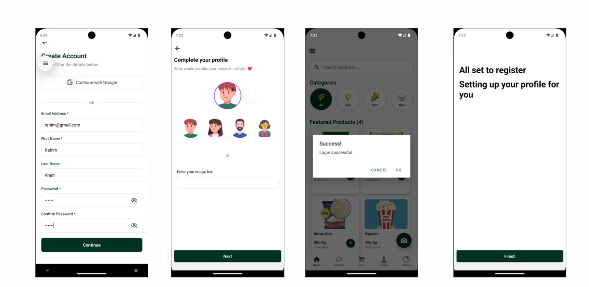
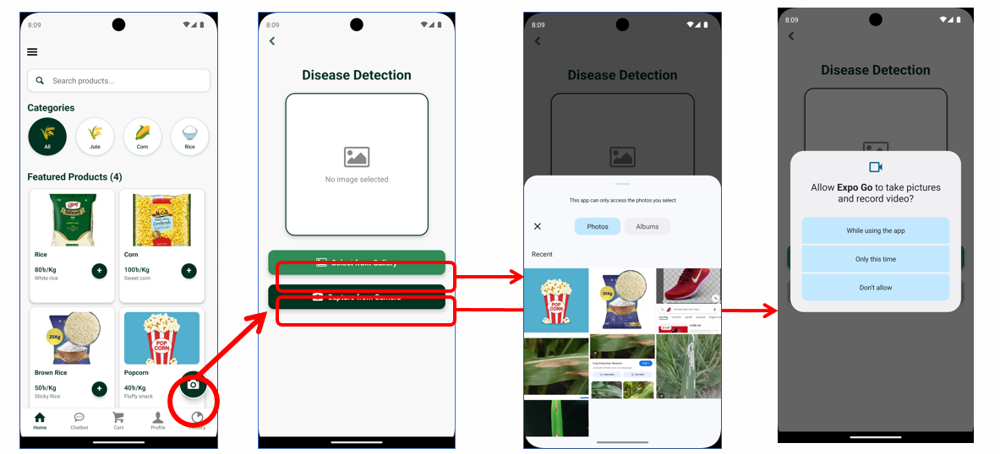
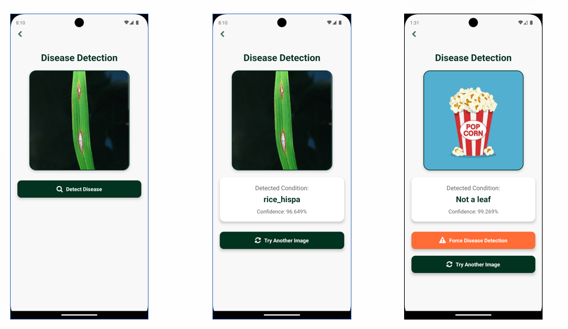
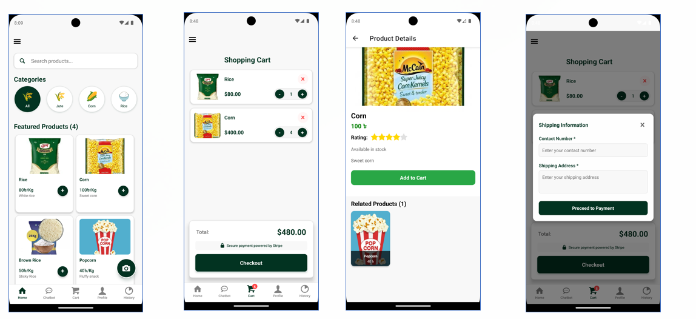

# 🌿 PlantGuard — AI-Powered Plant Disease Detection App

A mobile application that uses **Artificial Intelligence** to detect plant diseases from images and empowers farmers with instant diagnosis, expert guidance, and access to plant care products.

> *"Early plant disease detection remains a critical challenge for global agriculture."*

---


## 📋 Project Info

| Field | Details |
|-------|---------|
| **Course** | CSE 3200 — System Development Project |
| **Supervisor** | Abdul Aziz (Assistant Professor, CSE, KUET) |
| **Institution** | Khulna University of Engineering & Technology |

### 👥 Team Members

| Name | Roll |
|------|------|
| Sumaiya Khan | 2007031 |
| Md Kawsar Mahmud Khan Zunayed | 2007046 |

---

## 📸 Screenshots

| Auth | Detection | Detection | Marketplace |
|------|-----------|-------------|
|  |  |  |  |

---

## 🌟 Features

### 👨‍🌾 User Panel
| Feature | Description |
|---------|-------------|
| 🔐 Login & Signup | Firebase + JWT authentication with data security |
| 🔍 Disease Detection | Capture a photo and get instant AI-based diagnosis |
| 🤖 AI Chatbot | Interactive support for plant health questions anytime |
| 📰 News Feed | Curated agricultural news, research, and market trends |
| 🛒 Product Marketplace | Browse and buy recommended plant care products |
| 💳 Order & Payment | Secure payment via Stripe API |
| 📜 History | View past detections and orders |
| 👤 Profile Management | Manage personal account details |

### 🛠️ Admin Panel
| Feature | Description |
|---------|-------------|
| 👥 User Management | View and manage all registered users |
| 📦 Product & Inventory | Add and manage products |
| 📋 Order Processing | Track and update order statuses |
| 🔔 Notifications | Real-time alerts and content management |

---

## 🧠 AI Disease Detection Model

- **Model:** EfficientNetV2S
- **Supported Crops & Diseases:**

| Crop | Detectable Conditions |
|------|-----------------------|
| 🌽 Corn | Common Rust, Northern Leaf Blight, Healthy |
| 🪴 Jute | Cercospora Leaf Spot, Golden Mosaic, Healthy |
| 🌾 Rice | Leaf Blast, Leaf Scald, Healthy |

---

## 🛠️ Technology Stack

| Technology | Purpose |
|-----------|---------|
| **React Native** | Cross-platform mobile frontend |
| **Node.js** | Backend server & API |
| **MongoDB** | Database |
| **Firebase** | Authentication & real-time data |
| **Stripe API** | Secure payment processing |

---

## 🏗️ System Architecture

The platform is divided into two modules:

- **User Module** — For farmers: detect diseases, buy products, track orders
- **Admin Module** — For administrators: manage users, products, and orders

Both connect through a unified backend built on Node.js and MongoDB, with Firebase handling authentication.

---

## 🚀 Getting Started

### Prerequisites
- Node.js ≥ 18
- React Native CLI / Expo
- MongoDB instance
- Firebase project configured
- Stripe account for payments

### Installation

```bash
# Clone the repository
git clone https://github.com/your-username/plantguard.git
cd plantguard

# Install dependencies
npm install

# Start the backend
cd server
npm install
npm start

# Start the mobile app
cd ../app
npx react-native run-android
# or
npx expo start
```

### Environment Variables

Create a `.env` file in the server directory:

```env
MONGO_URI=your_mongodb_connection_string
FIREBASE_API_KEY=your_firebase_key
STRIPE_SECRET_KEY=your_stripe_secret
JWT_SECRET=your_jwt_secret
```

---

## ⚠️ Limitations

- **Lighting Conditions** — Optimal lighting is required for accurate image analysis
- **Rare Diseases** — Extremely rare plant diseases may need additional model training
- **Internet Connectivity** — Real-time analysis currently requires a stable internet connection

---

## 🔭 Future Plans

- Offline detection mode
- Expanded crop and disease coverage
- Multi-language support for broader accessibility
- Community forum for farmers

---

## 📄 Report & Slides

- 📊 [Presentation Slides (PPTX)](./final.pptx)

---


